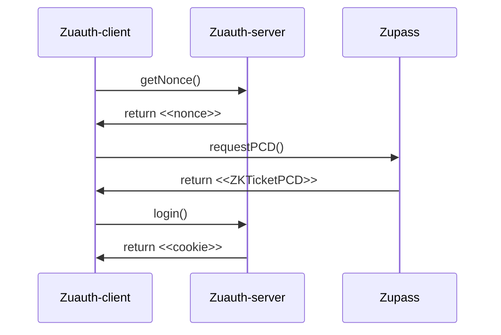

# ZuAuth Example

This example features an optional developer-friendly mode to choose an arbitrary subset (from none to all) of ticket fields to reveal during authentication with [zuauth](https://github.com/cedoor/zuauth/blob/main/README.md). With the developer mode disabled, only the predefined set of ticket fields (refer to the [Step 2](https://github.com/cedoor/zuauth/blob/main/README.md#client) below) will be displayed on the page. The main page component has multiple straightforward and tailored elements (e.g. Toggle) to ensure easy reading and customization. You can refer to an implementation of [iron-session](https://github.com/vvo/iron-session) for session management and usage of local storage to ensure consistency during page refreshes.


## 🛠 Install

Clone this repository:

```bash
git clone https://github.com/cedoor/zuauth.git
```

Navigate to the `example/` folder and install the dependencies:

```bash
cd zuauth/example && yarn # or npm i
```

## 📜 Usage

Copy the `.env` file as `.env.local`:

```bash
cp .env .env.local
```

### Basic Setup
Add your environment variables for the iron-session:
```env
IRON_COOKIE_NAME=your_cookie_name
IRON_PASSWORD=your_complex_password_at_least_32_characters
```

### Supabase Integration (Optional)

This example includes optional Supabase integration for persistent user storage.

1. Create a new Supabase project at [supabase.com](https://supabase.com)

2. Install Supabase client:
```bash
npm install @supabase/supabase-js
# or
yarn add @supabase/supabase-js
```

3. Set up your database by running this SQL in the Supabase SQL editor:
```sql
-- Create the main users table
CREATE TABLE users (
  id uuid default uuid_generate_v4() primary key,
  ticket_id text unique,
  event_id text,
  email text,
  created_at timestamp with time zone default timezone('utc'::text, now()),
  last_login timestamp with time zone,
  metadata jsonb
);

-- Enable Row Level Security
ALTER TABLE users ENABLE ROW LEVEL SECURITY;

-- Create a policy that allows users to read their own data
CREATE POLICY "Users can read their own data"
  ON users FOR SELECT
  USING (auth.uid() = id);

-- Create a policy that allows service role to do everything
CREATE POLICY "Service role can do everything"
  ON users FOR ALL
  USING (true)
  WITH CHECK (true);

-- Optional: Create login history table
CREATE TABLE login_history (
    id uuid default uuid_generate_v4() primary key,
    user_id uuid references users(id),
    logged_in_at timestamp with time zone default timezone('utc'::text, now())
);
```

4. Add Supabase credentials to `.env.local`:
```env
NEXT_PUBLIC_SUPABASE_URL=your-project-url
SUPABASE_SERVICE_KEY=your-service-role-key  # Use service_role key, not anon key
```

The Supabase integration provides:
- Persistent user storage
- Email tracking when revealed
- Login history (optional)
- Unique user records based on ticket ID
- Row-level security